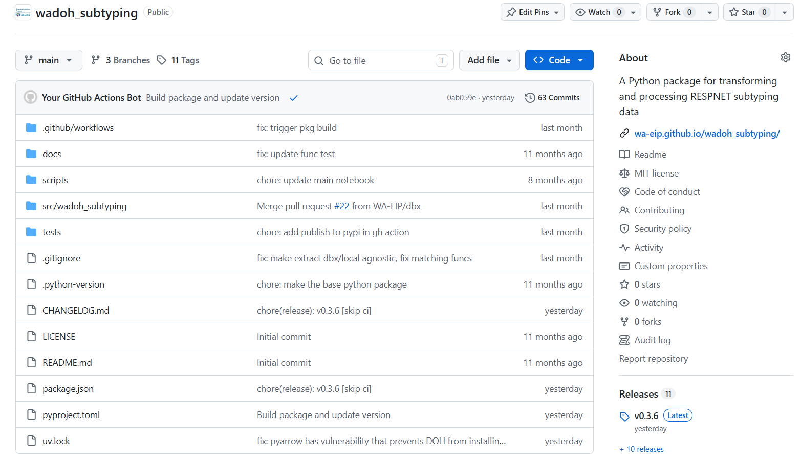

## Python for RESP-NET Subtype Linkage {.center}

Frank Aragona

Washington State Department of Health

```{ojs}
chart2 = {
  const colors = [
    "#ff3399",
    "hotpink",
    "hsl(330, 100%, 70.5%)",
    "rgba(128, 0, 128, 0.2)"
  ];

  const svg = d3.create("svg")
    .attr("width", 320)
    .attr("height", 60);

  const rects = svg.selectAll("rect")
    .data(colors)
    .join("rect")
      .attr("x", (_, i) => i * 55)
      .attr("y", 10)
      .attr("width", 50)
      .attr("height", 40)
      .attr("rx", 1)
      .attr("fill", d => d);

  function animate() {
    rects
      .interrupt() // stop any running transition
      .attr("opacity", 0)
      .attr("transform", "translate(-5,0)")
      .transition()
      .delay((_, i) => i * 400)
      .duration(500)
      .ease(d3.easeCubicOut)
      .attr("opacity", 1)
      .attr("transform", "translate(0,0)");
  }

  animate(); // run immediately

  const timer = d3.interval(animate, 4000);

  // Clean up when the cell is invalidated
  invalidation.then(() => timer.stop());

  return svg.node();
}
```


## Data Integration & Quality Assurance

<br>
<br>

<!-- - Data engineering (ETL pipelines)
- QA reports -->

```{ojs}
import { aq, op } from '@uwdata/arquero'
```

```{ojs}
categories = d3.schemeTableau10
  .filter((c, i) => i !== 2)
  .map(c => opacity(d3.color(c).brighter(), 0.3))
```

```{ojs}
opacity = (c, value) => {
  c = d3.color(c);
  c.opacity = value;
  return c + '';
}
```

```{ojs}
call = (arg, prefix, suffix = '') => {
  const elem = [md`&mdash; \`${prefix}(\``, arg, md`\`${suffix})\` ⟶`];
  const span = html`<span></span>`;
  
  elem.forEach(e => {
    e.style.display = 'inline-block';
    e.style.verticalAlign = 'top';
    e.style.marginRight = '0.4em';
    span.appendChild(e);
  });
  
  return span;
}
```

```{ojs}
function hconcat(...elem) {
  const span = html`<span></span>`;

  elem.forEach(e => {
    e.style.display = 'inline-block';
    e.style.verticalAlign = 'top';
    e.style.marginRight = '1em';
    span.appendChild(e);
  });

  return span;
}
```

```{ojs}
{
  const l = aq.table({ 
    id1: [1, 2, 3], 
    date: ["2025-04-03", "2025-05-03", "2025-08-24"] 
  });

  const r = aq.table({ 
    id2: [1, 6, 3], 
    subtype: ["H1", "H3", "H5"] 
  });

  // simulated fuzzy join result
  const j = aq.table({
    id: [1, 2, 3], 
    date: ["2025-04-03", "2025-05-03", "2025-08-24"] ,
    subtype: ["H1", null, "H5"] 
    // score: [1.0, 0.89]
  });

  const [cl, cr] = categories;

  const color = (f, c) => (i, r) =>
    i < 0 || j.get(f, r) == null ? null : c;

  const format = v => v == null ? '∅' : v + '';

  const opt = {
    color: {
        id: color('id', cl),
        date: color('date', cl),
        subtype: color('subtype', cr)
    },
    format: {
      id1: format,
      date: format,
      id2: format,
      subtype: format,
    //   score: format
    }
  };

  const container = html`<div style="text-align:center;"></div>`;

  container.appendChild(
    hconcat(
      l.view({ color: i => i < 0 ? null : cl }),
      call(r.view({ color: i => i < 0 ? null : cr }), ""),
      j.view(opt)
    )
  );

  return container;
}
```


<!-- join data, for ex. if someone has a flu hospitalization we want to enrich that dataset with their flu subtype data -->

## Project Standardization

- Python package for shared functionality
- Project specific py packages with similar structure
- Store code & documentation in **GitHub**

<!-- join data, for ex. if someone has a flu hospitalization we want to enrich that dataset with their flu subtype data -->

<!-- ::::: {.hierarchy}
:::: item
wadoh_raccoon

:::{.item color="#31166e"}
respnet_subtyping
:::

::: item
covid
:::

::: item
enterics
:::
::::
::::: -->

```{ojs}
main_pkg = {
  const colors = [
    "#ff3399",
    "hotpink",
    "hsl(330, 100%, 70.5%)",
    "rgba(128, 0, 128, 0.2)"
  ];

  const svg = d3.create("svg")
    .attr("width", "100%")
    .attr("height", 280)
    .attr("viewBox", "0 0 900 280");

  const size = 100;
  const y = 100;

  // Main package
  const mainX = 100;

  svg.append("rect")
    .attr("x", mainX)
    .attr("y", y)
    .attr("width", size)
    .attr("height", size)
    .attr("rx", 4)
    .attr("fill", colors[0]);

  svg.append("text")
    .attr("x", mainX + size / 2)
    .attr("y", 245)
    .attr("text-anchor", "middle")
    .attr("font-family", '"Maple Mono", monospace')
    .attr("font-size", 22)
    .attr("fill", "#555")
    .text("Main Package");


  // Border around dependent projects
  const groupX = 330;
  const groupY = 80;
  const groupWidth = 520;
  const groupHeight = 140;

  svg.append("rect")
    .attr("x", groupX)
    .attr("y", groupY)
    .attr("width", groupWidth)
    .attr("height", groupHeight)
    .attr("fill", "none")
    .attr("stroke", "black")
    .attr("stroke-width", 2);


  // Connection from main package to border
  svg.append("line")
    .attr("x1", mainX + size)
    .attr("y1", y + size / 2)
    .attr("x2", groupX)
    .attr("y2", y + size / 2)
    .attr("stroke", "#999")
    .attr("stroke-width", 2);


  // Dependent projects
  const projects = [
    { name: "project1", color: colors[1] },
    { name: "project2", color: colors[2] },
    { name: "project3", color: colors[3] }
  ];


  // Create project groups
  const projectGroups = svg.selectAll(".project")
    .data(projects)
    .join("g")
      .attr("class", "project")
      .attr("transform", (_, i) => `translate(${350 + i * 160 - 20},0)`)
      .attr("opacity", 0);


  // Labels
  projectGroups.append("text")
    .attr("x", size / 2)
    .attr("y", 60)
    .attr("text-anchor", "middle")
    .attr("font-family", '"Maple Mono", monospace')
    .attr("font-size", 18)
    .attr("fill", "#555")
    .text(d => d.name);


  // Squares
  projectGroups.append("rect")
    .attr("x", 0)
    .attr("y", y)
    .attr("width", size)
    .attr("height", size)
    .attr("rx", 4)
    .attr("fill", d => d.color);


  // Animation
  function animateProjects() {
    projectGroups
      .interrupt()
      .attr("opacity", 0)
      .attr("transform", (_, i) => 
        `translate(${350 + i * 160 - 20},0)`
      )
      .transition()
      .delay((_, i) => i * 400)
      .duration(600)
      .ease(d3.easeCubicOut)
      .attr("opacity", 1)
      .attr("transform", (_, i) => 
        `translate(${350 + i * 160},0)`
      );
  }


  animateProjects();


  // Stop animation when Observable cell is destroyed
  invalidation.then(() => {
    projectGroups.interrupt();
  });


  return svg.node();
}
```

## wadoh_raccoon

> If you need to reuse code more than 2x, **put it in a function.**
> If you reuse it across projects, **put it in a package.**
> Ensures that you use the exact **same methods in every project.**
> And saves hella time.

```{ojs}
base = {
  const colors = [
    "#ff3399",
    "rgba(128, 0, 128, 0.2)",
    "rgba(128, 0, 128, 0.2)",
    "rgba(128, 0, 128, 0.2)"
  ];

  const svg = d3.create("svg")
    .attr("width", "100%")
    .attr("height", 280)
    .attr("viewBox", "0 0 900 280");

  const size = 100;
  const y = 100;

  // Main package
  const mainX = 100;

  svg.append("rect")
    .attr("x", mainX)
    .attr("y", y)
    .attr("width", size)
    .attr("height", size)
    .attr("rx", 4)
    .attr("fill", colors[0]);

  svg.append("text")
    .attr("x", mainX + size / 2)
    .attr("y", 245)
    .attr("text-anchor", "middle")
    .attr("font-family", '"Maple Mono", monospace')
    .attr("font-size", 22)
    .attr("fill", "#555")
    .text("wadoh_raccoon");

  svg.append("text")
    .attr("x", mainX + size / 2)
    .attr("y", 270)
    .attr("text-anchor", "middle")
    .attr("font-family", '"Maple Mono", monospace')
    .attr("font-size", 16)
    .attr("fill", "#888")
    .text("Main py package");

  // Border around dependent projects
  const groupX = 330;
  const groupY = 80;
  const groupWidth = 520;
  const groupHeight = 140;

  svg.append("rect")
    .attr("x", groupX)
    .attr("y", groupY)
    .attr("width", groupWidth)
    .attr("height", groupHeight)
    .attr("fill", "none")
    .attr("stroke", "black")
    .attr("stroke-width", 2);


  // Connection from main package to border
  svg.append("line")
    .attr("x1", mainX + size)
    .attr("y1", y + size / 2)
    .attr("x2", groupX)
    .attr("y2", y + size / 2)
    .attr("stroke", "#999")
    .attr("stroke-width", 2);


  // Dependent projects
  const projects = [
    { name: "project1", color: colors[1] },
    { name: "project2", color: colors[2] },
    { name: "project3", color: colors[3] }
  ];


  // Create project groups
  const projectGroups = svg.selectAll(".project")
    .data(projects)
    .join("g")
      .attr("class", "project")
      .attr("transform", (_, i) => `translate(${350 + i * 160 - 20},0)`)
      .attr("opacity", 0);


  // Labels
  projectGroups.append("text")
    .attr("x", size / 2)
    .attr("y", 60)
    .attr("text-anchor", "middle")
    .attr("font-family", '"Maple Mono", monospace')
    .attr("font-size", 18)
    .attr("fill", "#555")
    .text(d => d.name);


  // Squares
  projectGroups.append("rect")
    .attr("x", 0)
    .attr("y", y)
    .attr("width", size)
    .attr("height", size)
    .attr("rx", 4)
    .attr("fill", d => d.color);


  // Animation
  function animateProjects() {
    projectGroups
      .interrupt()
      .attr("opacity", 0)
      .attr("transform", (_, i) => 
        `translate(${350 + i * 160 - 20},0)`
      )
      .transition()
      .delay((_, i) => i * 400)
      .duration(600)
      .ease(d3.easeCubicOut)
      .attr("opacity", 1)
      .attr("transform", (_, i) => 
        `translate(${350 + i * 160},0)`
      );
  }


  animateProjects();


  // Stop animation when Observable cell is destroyed
  invalidation.then(() => {
    projectGroups.interrupt();
  });


  return svg.node();
}
```


## wadoh_raccoon

```{ojs}
two = {
  const svg = d3.create("svg")
    .attr("width", "100%")
    .attr("height", 280)
    .attr("viewBox", "0 0 600 280");

  const x = 250;
  const y = 70;
  const size = 100;

  // Main square
  svg.append("rect")
    .attr("x", x)
    .attr("y", y)
    .attr("width", size)
    .attr("height", size)
    .attr("rx", 4)
    .attr("fill", "#ff3399");

  // Annotation line
  svg.append("line")
    .attr("x1", x + size / 2)
    .attr("y1", y + size)
    .attr("x2", x + size / 2)
    .attr("y2", 210)
    .attr("stroke", "#555")
    .attr("stroke-width", 3);

  // Main label
  svg.append("text")
    .attr("x", x + size / 2)
    .attr("y", 230)
    .attr("text-anchor", "middle")
    .attr("font-family", '"Maple Mono", monospace')
    .attr("font-size", 24)
    .attr("fill", "#555")
    .text("wadoh_raccoon");

  // Subtitle
  svg.append("text")
    .attr("x", x + size / 2)
    .attr("y", 260)
    .attr("text-anchor", "middle")
    .attr("font-family", '"Maple Mono", monospace')
    .attr("font-size", 20)
    .attr("fill", "#888")
    .text("Main py package");

  return svg.node();
}
```

```{ojs}
{
  const l = aq.table({ 
    CollectDate: ['1/2/25', '26-05-2022', 'Jan 05, 2024']
  });

  const r = aq.table({ 
    date_collected: ['2025-01-02', '2022-05-26', '2024-05-01']
  });

  const [cl, cr] = categories;

  const left = l.view({ color: i => i < 0 ? null : cl });
  const right = r.view({ color: i => i < 0 ? null : cr });

  left.style.width = "260px";
  right.style.width = "260px";

  const arrow = html`
    <div style="
      display:inline-block;
      vertical-align:middle;
      margin: 0 1.5em;
      font-size: 28px;
      color:#555;
    ">
      →
    </div>
  `;

  const container = html`
    <div style="
      text-align:center;
      display:flex;
      justify-content:center;
      align-items:center;
    "></div>
  `;

  container.appendChild(left);
  container.appendChild(arrow);
  container.appendChild(right);

  return container;
}
```

## wadoh_raccoon


```{ojs}
one = {
  const svg = d3.create("svg")
    .attr("width", "100%")
    .attr("height", 280)
    .attr("viewBox", "0 0 600 280");

  const x = 250;
  const y = 70;
  const size = 100;

  // Main square
  svg.append("rect")
    .attr("x", x)
    .attr("y", y)
    .attr("width", size)
    .attr("height", size)
    .attr("rx", 4)
    .attr("fill", "#ff3399");

  // Annotation line
  svg.append("line")
    .attr("x1", x + size / 2)
    .attr("y1", y + size)
    .attr("x2", x + size / 2)
    .attr("y2", 210)
    .attr("stroke", "#555")
    .attr("stroke-width", 3);

  // Main label
  svg.append("text")
    .attr("x", x + size / 2)
    .attr("y", 230)
    .attr("text-anchor", "middle")
    .attr("font-family", '"Maple Mono", monospace')
    .attr("font-size", 24)
    .attr("fill", "#555")
    .text("wadoh_raccoon");

  // Subtitle
  svg.append("text")
    .attr("x", x + size / 2)
    .attr("y", 260)
    .attr("text-anchor", "middle")
    .attr("font-family", '"Maple Mono", monospace')
    .attr("font-size", 20)
    .attr("fill", "#888")
    .text("Main py package");

  return svg.node();
}
```


```{ojs}
{
  const l = aq.table({ 
    name1: ['JADE', 'SUB-ZERO', 'SCORPION'], 
    // y: [1, 2, 3] 
  });

  const r = aq.table({ 
    name2: ['Jade', 'Subbbzero', 'Rain'], 
    // v: [4, 5, 6] 
  });

  // simulated fuzzy join result
  const j = aq.table({
    name1: ['jade', 'subzero'],
    // y: [1, 2, 3],
    name2: ['jade', 'subbbzero'],
    // v: [4, 5, null],
    score: [1.0, 0.89]
  });

  const [cl, cr] = categories;

  const color = (f, c) => (i, r) =>
    i < 0 || j.get(f, r) == null ? null : c;

  const format = v => v == null ? '∅' : v + '';

  const opt = {
    color: {
      name1: color('name1', cl),
    //   y: color('y', cl),
      name2: color('name2', cr),
    //   v: color('v', cr)
    },
    format: {
      name1: format,
    //   y: format,
      name2: format,
    //   v: format,
      score: format
    }
  };

  const container = html`<div style="text-align:center;"></div>`;

  container.appendChild(
    hconcat(
      l.view({ color: i => i < 0 ? null : cl }),
      call(r.view({ color: i => i < 0 ? null : cr }), 'join name1', ' to name2'),
      j.view(opt)
    )
  );

  return container;
}
```

<!-- ## wadoh_raccoon Install

::::{.codewindow width="350px"}

::: {.editor .fragment .terminal name="uv"}
```bash
uv add wadoh_raccoon
```
:::

::: {.editor .fragment .terminal name="pip"}
```bash
pip install wadoh_raccoon
```
:::

:::: -->

## 

```{ojs}
pkg1 = {
  const colors = [
    "#ff3399",
    "hotpink",
    "rgba(128, 0, 128, 0.2)",
    "rgba(128, 0, 128, 0.2)"
  ];

  const svg = d3.create("svg")
    .attr("width", "100%")
    .attr("height", 300)
    .attr("viewBox", "0 0 900 300");

  const size = 100;
  const y = 100;

  // Main package (de-emphasized)
  const mainX = 100;

  svg.append("rect")
    .attr("x", mainX)
    .attr("y", y)
    .attr("width", size)
    .attr("height", size)
    .attr("rx", 4)
    .attr("fill", colors[0])
    .attr("fill-opacity", 0.25);

  svg.append("text")
    .attr("x", mainX + size / 2)
    .attr("y", 245)
    .attr("text-anchor", "middle")
    .attr("font-family", '"Maple Mono", monospace')
    .attr("font-size", 22)
    .attr("fill", "#555")
    .attr("fill-opacity", 0.4)
    .text("wadoh_raccoon");

  svg.append("text")
    .attr("x", mainX + size / 2)
    .attr("y", 270)
    .attr("text-anchor", "middle")
    .attr("font-family", '"Maple Mono", monospace')
    .attr("font-size", 16)
    .attr("fill", "#888")
    .attr("fill-opacity", 0.4)
    .text("Main py package");

  // Group border
  const groupX = 330;
  const groupY = 80;
  const groupWidth = 520;
  const groupHeight = 160;

  svg.append("rect")
    .attr("x", groupX)
    .attr("y", groupY)
    .attr("width", groupWidth)
    .attr("height", groupHeight)
    .attr("fill", "none")
    .attr("stroke", "black")
    .attr("stroke-width", 2);

  // Connection (also de-emphasized)
  svg.append("line")
    .attr("x1", mainX + size)
    .attr("y1", y + size / 2)
    .attr("x2", groupX)
    .attr("y2", y + size / 2)
    .attr("stroke", "#999")
    .attr("stroke-width", 2)
    .attr("stroke-opacity", 0.4);

  // Projects
  const projects = [
    { name: "wadoh_subtyping", color: colors[1] },
    { name: "project2", color: colors[2] },
    { name: "project3", color: colors[3] }
  ];

  projects.forEach((p, i) => {
    const focused = i === 0;

    const projectSize = focused ? 120 : 100;
    const x = 350 + i * 160 - (projectSize - 100) / 2;
    const projectY = focused ? y - 10 : y;

    svg.append("text")
      .attr("x", x + projectSize / 2)
      .attr("y", 60)
      .attr("text-anchor", "middle")
      .attr("font-family", '"Maple Mono", monospace')
      .attr("font-size", focused ? 20 : 18)
      .attr("font-weight", focused ? "bold" : null)
      .attr("fill", focused ? "#333" : "#999")
      .attr("fill-opacity", focused ? 1 : 0.4)
      .text(p.name);

    svg.append("rect")
      .attr("x", x)
      .attr("y", projectY)
      .attr("width", projectSize)
      .attr("height", projectSize)
      .attr("rx", 4)
      .attr("fill", p.color)
      .attr("fill-opacity", focused ? 1 : 0.25);
  });

  return svg.node();
}
```


::::: process

:::: item
Lab

::: annotation
Take sample, **send** specimens to PHL
:::

::::

:::: item
PHL

::: annotation
**Subtype** the specimen, store in LIMS
:::

::::

:::: {.item color="hotpink"}
DIQA

::: annotation
**Join** subtype to hospitalization record in WDRS
:::

::::

:::: item
WDRS

::: annotation
**Store** hospitalization and subtype info
:::

::::

:::: item
REDCap

::: annotation
**Report** hospitalization and subtype info to users
:::

::::

:::::

## wadoh_subtyping - simple things

```{ojs}
subtype_pkg1 = {
  const svg = d3.create("svg")
    .attr("width", "100%")
    .attr("height", 280)
    .attr("viewBox", "0 0 600 280");

  const x = 250;
  const y = 70;
  const size = 100;

  // Main square
  svg.append("rect")
    .attr("x", x)
    .attr("y", y)
    .attr("width", size)
    .attr("height", size)
    .attr("rx", 4)
    .attr("fill", "rgba(128, 0, 128, 0.2)");

  // Annotation line
  svg.append("line")
    .attr("x1", x + size / 2)
    .attr("y1", y + size)
    .attr("x2", x + size / 2)
    .attr("y2", 210)
    .attr("stroke", "#555")
    .attr("stroke-width", 3);

  // Main label
  svg.append("text")
    .attr("x", x + size / 2)
    .attr("y", 230)
    .attr("text-anchor", "middle")
    .attr("font-family", '"Maple Mono", monospace')
    .attr("font-size", 24)
    .attr("fill", "#555")
    .text("wadoh_subtyping");

  // Subtitle
  svg.append("text")
    .attr("x", x + size / 2)
    .attr("y", 260)
    .attr("text-anchor", "middle")
    .attr("font-family", '"Maple Mono", monospace')
    .attr("font-size", 20)
    .attr("fill", "#888")
    .text("subtype py package");

  return svg.node();
}
```

```{ojs}
{
  const l = aq.table({ 
    lab: [
        "Harborview Medical Center",
        "Kaiser Permanente - Seattle",
        "Labcorp - Seattle Cherry Hill"
    ]
  });

  const r = aq.table({ 
    clean_lab: [
        "82558",
        "2752312620",
        "6130705570",
    ]
  });

  const [cl, cr] = categories;

  const left = l.view({ color: i => i < 0 ? null : cl });
  const right = r.view({ color: i => i < 0 ? null : cr });

  left.style.width = "260px";
  right.style.width = "260px";

  const arrow = html`
    <div style="
      display:inline-block;
      vertical-align:middle;
      margin: 0 1.5em;
      font-size: 28px;
      color:#555;
    ">
      →
    </div>
  `;

  const container = html`
    <div style="
      text-align:center;
      display:flex;
      justify-content:center;
      align-items:center;
    "></div>
  `;

  container.appendChild(left);
  container.appendChild(arrow);
  container.appendChild(right);

  return container;
}
```

## wadoh_subtyping - not so simple things

::::{.codewindow}

:::{.editor .py name="match.py"}

```python
# run ID matching - join to 
# comma separate, need to explode the values in respnet
respnet_explode = (
    pull_res.respnet
    .with_columns(
        pl.col("CDC_N_COV_2019_HOSPITALIZED_RESPNET_MRN").str.split(", "),
    )
    .explode(["CDC_N_COV_2019_HOSPITALIZED_RESPNET_MRN"])
    .with_columns(
        pl.col("RESPNET_HOSPITALIZED_RHINO_MRN").str.split(", "),
    )
    .explode(["RESPNET_HOSPITALIZED_RHINO_MRN"])
    .with_columns(
        pl.when(
            (
                pl.col('CDC_N_COV_2019_HOSPITALIZED_RESPNET_MRN').is_null() 
                & pl.col('RESPNET_HOSPITALIZED_RHINO_MRN').is_null()
            )
        )
        .then(None)
        .when(
            (
                pl.col('CDC_N_COV_2019_HOSPITALIZED_RESPNET_MRN').is_not_null() 
                & pl.col('RESPNET_HOSPITALIZED_RHINO_MRN').is_null()
            )
        )
        .then(pl.col('CDC_N_COV_2019_HOSPITALIZED_RESPNET_MRN'))
        .when(
            (
                pl.col('CDC_N_COV_2019_HOSPITALIZED_RESPNET_MRN').is_null() 
                & pl.col('RESPNET_HOSPITALIZED_RHINO_MRN').is_not_null()
            )
        )
        .then(pl.col('RESPNET_HOSPITALIZED_RHINO_MRN'))
        .when(
            (
                pl.col('CDC_N_COV_2019_HOSPITALIZED_RESPNET_MRN').is_not_null() 
                & pl.col('RESPNET_HOSPITALIZED_RHINO_MRN').is_not_null()
            )
        )
        .then(pl.col('CDC_N_COV_2019_HOSPITALIZED_RESPNET_MRN'))
        .otherwise(None)
        .alias('MRN')
    )
    .filter(pl.col('MRN').is_not_null())
)

# find records without demographics or that didn't match and try to match on MRN matching
mrn_base_cols = [
            'submission_number',
            'internal_create_date',
            'submitted_dob',
            'submitted_collection_date',
            'first_name_clean',
            'last_name_clean'
            ]
match_by_mrn = (
    pl.concat([
        fuzzy_matched_none.select(mrn_base_cols),
        fuzzy_without_demo_df.select(mrn_base_cols)
    ])
    .join(w_res.submissions_to_fuzzy, how='left',on='submission_number')
    .filter(
        (pl.col('SubmitterPatientNumber').is_not_null()) &
        (pl.col('SubmitterPatientNumber') != "")
    )
    .select(mrn_base_cols + [
        'SubmitterPatientNumber',
        'PatientFirstName',
        'PatientLastName',
        'SpecimenDateCollected',
        'SpecimenDateReceived'
        ]
    )
)

```

:::
::::

## GitHub 

```{ojs}
data = ({
  name: "wadoh_subtyping",
  children: [
    {
      name: "src",
      children: [
        {
          name: "wadoh_subtyping",
          children: [
            { name: "__init__.py" },
            { name: "main.py" },
            { name: "config.py" },
            { name: "utils.py" },
            { name: "models.py" }
          ]
        }
      ]
    },
    {
      name: "tests",
      children: [
        { name: "__init__.py" },
        { name: "test_main.py" },
        { name: "test_utils.py" }
      ]
    },
    {
      name: "docs",
      children: [
        { name: "_quarto.yml" },
        { name: "index.qmd" }
      ]
    },
    {
      name: ".github",
      children: [
        {
          name: "workflows",
          children: [
            { name: "ci.yml" }
          ]
        }
      ]
    },
    { name: "pyproject.toml" },
    { name: "uv.lock" },
    { name: "README.md" },
    { name: "LICENSE" }
  ]
})
```

```{ojs}
function collapsibleIndent(data, options = {}) {
  const {
    indentSpacing = 25,
    lineSpacing = 35,
    duration = 300,
    radius = 6, // radius of curve for links
    minHeight = 20,
    boxSize = 20.5,
    ease = d3.easeQuadInOut, // https://observablehq.com/@d3/easing-animations
    marginLeft = Math.round(boxSize/2)+1,
    marginRight = 120,
    marginTop = 10,
    marginBottom = 10,
  } = options;
  // WARNING: x and y are switched because the d3.tree is vertical rather than the default horizontal
  // settings
  
  let plus  = {shapeFill: "black", shapeStroke: "black", textFill:"white", text: "+"}
  let minus = {shapeFill: "white", shapeStroke: "black", textFill:"black", text: "−"}
  
  //
  let tree = d3.tree()
    .nodeSize([lineSpacing, indentSpacing])
  
  let root = d3.hierarchy(data); 
  
  root.x0 = 0;
  root.y0 = 0; 
  root.descendants().forEach((d, i) => {
    d.id = i;
    d._children = d.children;
    if (d.depth && d.data.name.length !== 7) d.children = null;
  });

  let index = -1;
  root.eachBefore(function(n) {++index}) // counts original number of items
  
  const svg = d3.create("svg")
      .attr("viewBox", [-marginLeft, -marginTop, width, Math.max(minHeight, index * lineSpacing + marginTop + marginBottom )])
      .style("font", "30px sans-serif")
      .style("user-select", "none");

  const gLink = svg.append("g")
      .attr("fill", "none")
      .attr("stroke", "#AAA")
      .attr("stroke-width", .75);

  const gNode = svg.append("g")
      .attr("cursor", "pointer")
      .attr("pointer-events", "all");

  let indexLast
  function update(source) {
    const nodes = root.descendants().reverse();
    const links = root.links();

    // Compute the new tree layout.
    tree(root);
    
    // node position function
    index = -1;
    root.eachBefore(function(n) {
      n.x = ++index * lineSpacing;
      n.y = n.depth * indentSpacing;
    });

    const height = Math.max(minHeight, index * lineSpacing + marginTop + marginBottom );

    svg.transition().delay(indexLast<index ? 0 : duration).duration(0)
      .attr("viewBox", [-marginLeft,  - marginTop, width, height])

    // Update the nodes…
    const node = gNode.selectAll("g")
      .data(nodes, d => d.id);

    // Enter any new nodes at the parent's previous position.
    const nodeEnter = node.enter().append("g")
        .attr("transform", d => `translate(${d.y},${source.x0})`)
        .attr("fill-opacity", 0)
        .attr("stroke-opacity", 0)
        .on("click", (event, d) => {
          
          d.children = d.children ? null : d._children;
          update(d);

          charge
            .attr("fill", d => d._children ? ( d.children ? minus.textFill : plus.textFill ) : "none")
            .text(d => d._children ? ( d.children ? minus.text : plus.text ) : "");

          box.attr("fill", d => d._children ? ( d.children ? minus.shapeFill : plus.shapeFill ) : "none")
          
        });

    // check box
    let box = nodeEnter.append("rect")
      .attr("width", boxSize)
      .attr("height", boxSize)
      .attr("x", -boxSize/2)
      .attr("y", -boxSize/2)
      .attr("fill", d => d._children ? ( d.children ? minus.shapeFill : plus.shapeFill ) : "none")
      .attr("stroke", d => d._children ? "black" : "none")
      .attr("stroke-width", .5);

    // check box symbol
    let charge = nodeEnter.append("text")
      .attr("x", 0 )
      .attr("text-anchor", "middle")
      .attr("alignment-baseline", "central")
      .attr("fill", d => d._children ? ( d.children ? minus.textFill : plus.textFill ) : "none")
      .text(d => d._children ? ( d.children ? "−" : "+" ) : "");

    // label text
    let label = nodeEnter.append("text")
      .attr("x", 5+boxSize/2)
      .attr("text-anchor", "start")
      .attr("dy", "0.32em")
      .text(d => d.data.name);
    
    // Transition nodes to their new position.
    const nodeUpdate = node.merge(nodeEnter).transition().duration(duration).ease(ease)
        .attr("transform", d => `translate(${d.y},${d.x})`)
        .attr("fill-opacity", 1)
        .attr("stroke-opacity", 1)

    // Transition exiting nodes to the parent's new position.
    const nodeExit = node.exit().transition().duration(duration).ease(ease).remove()
        .attr("transform", d => `translate(${d.y},${source.x})`)
        .attr("fill-opacity", 0)
        .attr("stroke-opacity", 0);

    // Update the links…
    const link = gLink.selectAll("path")
      .data(links, d => d.target.id);

    // Enter any new links at the parent's previous position.
    const linkEnter = link.enter().append("path")
        .attr("stroke-opacity", 0)
        .attr("d", d => makeLink([d.source.y,source.x] , [d.target.y + (d.target._children ? 0 : boxSize/2 ), source.x] , radius) );

    // Transition links to their new position.
    link.merge(linkEnter).transition().duration(duration).ease(ease)
        .attr("stroke-opacity", 1)
        .attr("d", d => makeLink([d.source.y,d.source.x] , [d.target.y + (d.target._children ? 0 : boxSize/2 ), d.target.x] , radius));

    // Transition exiting nodes to the parent's new position.
    link.exit().transition().duration(duration).ease(ease).remove()
        .attr("stroke-opacity", 0)
        .attr("d", d => makeLink([d.source.y, source.x] , [d.target.y + (d.target._children ? 0 : boxSize/2 ), source.x] , radius) );

    // Stash the old positions for transition.
    root.eachBefore(d => {
      d.x0 = d.x;
      d.y0 = d.y;
    });

    indexLast = index // to know if viewbox is expanding or contracting
  }

  update(root);

  return svg.node();
}
```


```{ojs}
makeLink = (start, end, radius) => {
  const path = d3.path();
  const dh = 4/3*Math.tan(Math.PI/8) // tangent handle offset

  //flip curve
  let fx, fy
  if(end[0] - start[0] == 0){ fx = 0}
  else if(end[0] - start[0] > 0) {fx = 1} 
  else {fx = -1}
  if(end[1] - start[1] == 0){ fy = 0}
  else if(end[1] - start[1] > 0) {fy = 1} 
  else {fy = -1}

  //scale curve when dx or dy is less than the radius
  if( radius == 0 ){ fx=0; fy=0}
  else{
    fx *= Math.min( Math.abs(start[0]-end[0]), radius) / radius
    fy *= Math.min( Math.abs(start[1]-end[1]), radius) / radius
  }

  path.moveTo(...start);
  path.lineTo(...[start[0], end[1]-fy*radius]);
  path.bezierCurveTo(
    ...[start[0], end[1]+fy*radius*(dh-1)] , 
    ...[start[0]+fx*radius*(1-dh), end[1]], 
    ...[start[0]+fx*radius, end[1]]);
  path.lineTo(...end);
  return path
}
```

```{ojs}
collapsibleIndent(data)
```


## GitHub 

{width=1000}

## Release Cycle

::::: circle-flow

:::: item
Plan

::: annotation
**Plan** define scope, goals, and success metrics up front
:::

::::

:::: item
Build

::: annotation
**Build** implement the work in small, reviewable increments
:::

::::

:::: item
Ship

::: annotation
**Ship** release to users and monitor for issues
:::

::::

:::::