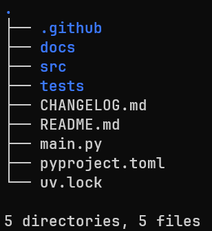
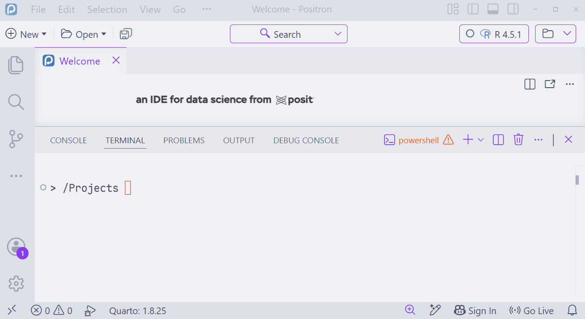
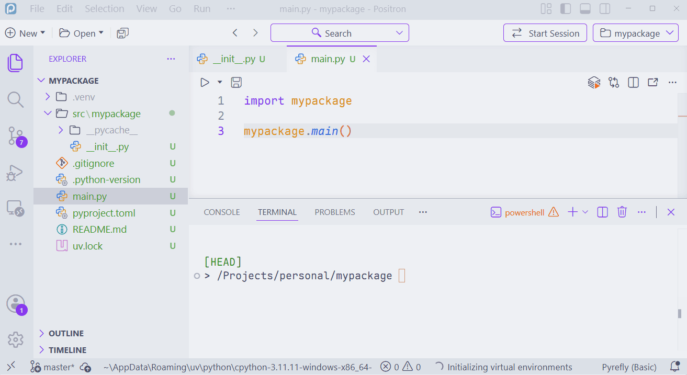
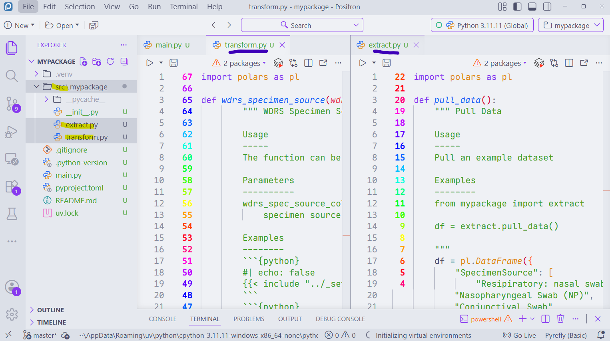
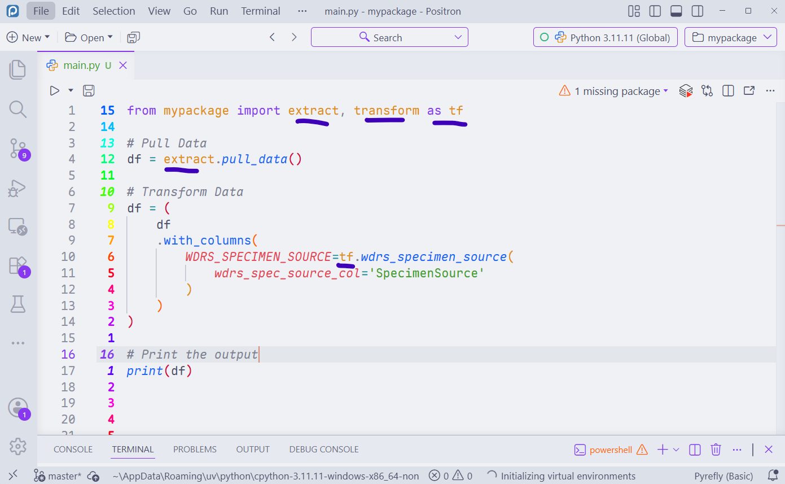
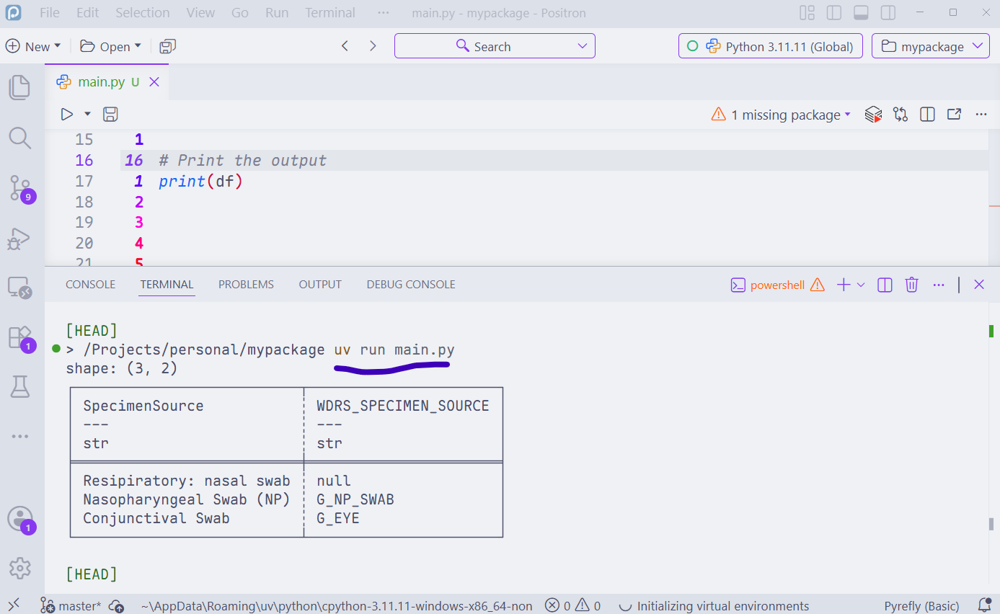
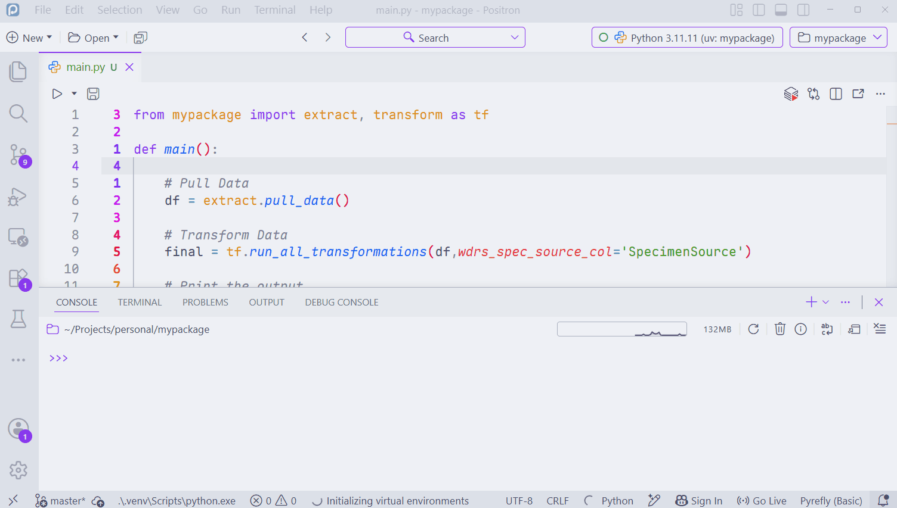

## FluSurv-NET subtype data linkage {.center}

_Python, packages, and modular codebases_

<!-- _Using respnet data linkage as an example_ -->

<!-- _Using python and GitHub for RESP-NET Subtype Linkage_ -->

Frank Aragona | Washington State Department of Health

:::{.notes}
A disclaimer before we start. If you've never used python or GitHub before, then this presentation
might be overwhelming. I don't _want_ to overwhelm anyone, but I am going to cover a lot.

We've learned a lot about software development over the last few years and this is the outcome.

My goal for the presentation is to give at least one person a lightbulb moment.

There are many topics here, all with their own details, but if at least one of those topics clicks with you and you implement it in your work, then I've done a good job.

:::


```{ojs}
chart2 = {
  const colors = [
    "#ff3399",
    "hotpink",
    "hsl(330, 100%, 70.5%)",
    "rgba(128, 0, 128, 0.2)"
  ];

  const svg = d3.create("svg")
    .attr("width", 320)
    .attr("height", 60);

  const rects = svg.selectAll("rect")
    .data(colors)
    .join("rect")
      .attr("x", (_, i) => i * 55)
      .attr("y", 10)
      .attr("width", 50)
      .attr("height", 40)
      .attr("rx", 1)
      .attr("fill", d => d);

  function animate() {
    rects
      .interrupt() // stop any running transition
      .attr("opacity", 0)
      .attr("transform", "translate(-5,0)")
      .transition()
      .delay((_, i) => i * 400)
      .duration(500)
      .ease(d3.easeCubicOut)
      .attr("opacity", 1)
      .attr("transform", "translate(0,0)");
  }

  animate(); // run immediately

  const timer = d3.interval(animate, 4000);

  // Clean up when the cell is invalidated
  invalidation.then(() => timer.stop());

  return svg.node();
}
```


## Data Integration & Quality Assurance

<br>
<br>

<!-- - Data engineering (ETL pipelines)
- QA reports -->

```{ojs}
import { aq, op } from '@uwdata/arquero'
```

```{ojs}
categories = d3.schemeTableau10
  .filter((c, i) => i !== 2)
  .map(c => opacity(d3.color(c).brighter(), 0.3))
```

```{ojs}
opacity = (c, value) => {
  c = d3.color(c);
  c.opacity = value;
  return c + '';
}
```

```{ojs}
call = (arg, prefix, suffix = '') => {
  const elem = [md`&mdash; \`${prefix}(\``, arg, md`\`${suffix})\` ⟶`];
  const span = html`<span></span>`;
  
  elem.forEach(e => {
    e.style.display = 'inline-block';
    e.style.verticalAlign = 'top';
    e.style.marginRight = '0.4em';
    span.appendChild(e);
  });
  
  return span;
}
```

```{ojs}
function hconcat(...elem) {
  const span = html`<span></span>`;

  elem.forEach(e => {
    e.style.display = 'inline-block';
    e.style.verticalAlign = 'top';
    e.style.marginRight = '1em';
    span.appendChild(e);
  });

  return span;
}
```

```{ojs}
{
  const l = aq.table({ 
    id1: [1, 2, 3], 
    date: ["2025-04-03", "2025-05-03", "2025-08-24"] 
  });

  const r = aq.table({ 
    id2: [1, 6, 3], 
    subtype: ["H1", "H3", "H5"] 
  });

  // simulated fuzzy join result
  const j = aq.table({
    id: [1, 2, 3], 
    date: ["2025-04-03", "2025-05-03", "2025-08-24"] ,
    subtype: ["H1", null, "H5"] 
    // score: [1.0, 0.89]
  });

  const [cl, cr] = categories;

  const color = (f, c) => (i, r) =>
    i < 0 || j.get(f, r) == null ? null : c;

  const format = v => v == null ? '∅' : v + '';

  const opt = {
    color: {
        id: color('id', cl),
        date: color('date', cl),
        subtype: color('subtype', cr)
    },
    format: {
      id1: format,
      date: format,
      id2: format,
      subtype: format,
    //   score: format
    }
  };

  const container = html`<div style="text-align:center;"></div>`;

  container.appendChild(
    hconcat(
      l.view({ color: i => i < 0 ? null : cl }),
      call(r.view({ color: i => i < 0 ? null : cr }), ""),
      j.view(opt)
    )
  );

  return container;
}
```


<!-- join data, for ex. if someone has a flu hospitalization we want to enrich that dataset with their flu subtype data -->

## Outline

::: {.notes}
- I'm gonna show how we standardize our coding projects
- We used to not standardize them at all
- We would end up with giant scripts of 5000+ lines
- It got very confusing and unstable when trying to make updates or fix bugs

- In addition, we started creating more projects so we needed to copy and paste code throught

- So, we worked on making our systems modular **that's really what this presentation is about**

Specifically I'll show:

- how to make a modular codebase (using python, but this can be applied to any other programming language)
- and How and Why we should use github to store our code and documentation


:::


- How we solved a subtyping **data linkage problem** using **python**
- How to **create a python project**

## Problem

- LIMS database does not connect to WDRS


::::: process

:::: item
Lab

::: annotation
Take sample, **send** specimens to PHL
:::

::::

:::: item
PHL

::: annotation
**Subtype** the specimen, store in LIMS
:::

::::

:::: {.item color="hotpink"}
DIQA

::: annotation
**Join** subtype to hospitalization record in WDRS
:::

::::

:::: item
WDRS

::: annotation
**Store** hospitalization and subtype info
:::

::::

:::: item
REDCap

::: annotation
**Report** hospitalization and subtype info to users
:::

::::

:::::

## Solution

- Used python to transform data and link LIMS records to WDRS

```{ojs}
{
  const l = aq.table({ 
    id1: [1, 2, 3], 
    name1: ["JADE", "zero", "scorpion"], 
    date: ["2025-04-03", "2025-05-03", "2025-08-24"] 
  });

  const r = aq.table({ 
    name2: ["Jade", "subzero", "rain"], 
    subtype: ["H1", "H3", "H5"] 
  });


  const j = aq.table({
    id: [1, 2, 3], 
    date: ["2025-04-03", "2025-05-03", "2025-08-24"] ,
    subtype: ["H1", "H3", null] 
    // score: [1.0, 0.89]
  });

  const [cl, cr] = categories;

  const color = (f, c) => (i, r) =>
    i < 0 || j.get(f, r) == null ? null : c;

  const format = v => v == null ? '∅' : v + '';

  const opt = {
    color: {
        id: color('id', cl),
        date: color('date', cl),
        subtype: color('subtype', cr)
    },
    format: {
      id1: format,
      date: format,
      name1: format,
      name2: format,
      subtype: format,
    //   score: format
    }
  };

  const container = html`<div style="text-align:center;"></div>`;

  container.appendChild(
    hconcat(
      l.view({ color: i => i < 0 ? null : cl }),
      call(r.view({ color: i => i < 0 ? null : cr }), ""),
      j.view(opt)
    )
  );

  return container;
}
```

## How do we do this 

:::{.notes}
- We took apart the code and rebuilt it with modularity in mind
- we rebuilt it with small blocks
- like a car, whenever we get a flat tire we can just replace the tire instead of digging through the entire car's engineering to fix it
:::

:::{.columns}

:::{.column width="50%"}
:::{.codewindow .python .codewindow-dark}
old_main.py



:::
:::

:::{.column width="50%"}
:::{.codewindow .python .active .codewindow-dark}
main.py
```{python}
#| eval: false
#| echo: true
from wadoh_subtyping import extract, load, matching, wrangle

def main(write_data=False):

    # run data pulls
    pull_res = extract.run_pulls()

    # run transformations
    w_res = wrangle.wrangle_phl(pull_res)

    # run matching
    res = matching.match_phl(pull_res,w_res)

    # combined rosters from rematch, regular, and manually reviewed
    final_roster = wrangle.combine_the_rosters(rematch, res, reviewed_roster)
  
  # boilerplate, run the script inside the main.py file
if __name__ == "__main__":
    main()
```
:::
:::
:::


## Modularity

```{ojs}
main_pkg = {
  const colors = [
    "#ff3399",
    "hotpink",
    "hsl(330, 100%, 70.5%)",
    "rgba(128, 0, 128, 0.2)"
  ];

  const svg = d3.create("svg")
    .attr("width", "100%")
    .attr("height", 280)
    .attr("viewBox", "0 0 900 280");

  const size = 100;
  const y = 100;

  // Main package
  const mainX = 100;

  svg.append("rect")
    .attr("x", mainX)
    .attr("y", y)
    .attr("width", size)
    .attr("height", size)
    .attr("rx", 4)
    .attr("fill", colors[0]);

  svg.append("text")
    .attr("x", mainX + size / 2)
    .attr("y", 245)
    .attr("text-anchor", "middle")
    .attr("font-family", '"Maple Mono", monospace')
    .attr("font-size", 22)
    .attr("fill", "#555")
    .text("Main Package");


  // Border around dependent projects
  const groupX = 330;
  const groupY = 80;
  const groupWidth = 520;
  const groupHeight = 140;

  svg.append("rect")
    .attr("x", groupX)
    .attr("y", groupY)
    .attr("width", groupWidth)
    .attr("height", groupHeight)
    .attr("fill", "none")
    .attr("stroke", "black")
    .attr("stroke-width", 2);


  // Connection from main package to border
  svg.append("line")
    .attr("x1", mainX + size)
    .attr("y1", y + size / 2)
    .attr("x2", groupX)
    .attr("y2", y + size / 2)
    .attr("stroke", "#999")
    .attr("stroke-width", 2);


  // Dependent projects
  const projects = [
    { name: "project1", color: colors[1] },
    { name: "project2", color: colors[2] },
    { name: "project3", color: colors[3] }
  ];


  // Create project groups
  const projectGroups = svg.selectAll(".project")
    .data(projects)
    .join("g")
      .attr("class", "project")
      .attr("transform", (_, i) => `translate(${350 + i * 160 - 20},0)`)
      .attr("opacity", 0);


  // Labels
  projectGroups.append("text")
    .attr("x", size / 2)
    .attr("y", 60)
    .attr("text-anchor", "middle")
    .attr("font-family", '"Maple Mono", monospace')
    .attr("font-size", 18)
    .attr("fill", "#555")
    .text(d => d.name);


  // Squares
  projectGroups.append("rect")
    .attr("x", 0)
    .attr("y", y)
    .attr("width", size)
    .attr("height", size)
    .attr("rx", 4)
    .attr("fill", d => d.color);


  // Animation
  function animateProjects() {
    projectGroups
      .interrupt()
      .attr("opacity", 0)
      .attr("transform", (_, i) => 
        `translate(${350 + i * 160 - 20},0)`
      )
      .transition()
      .delay((_, i) => i * 400)
      .duration(600)
      .ease(d3.easeCubicOut)
      .attr("opacity", 1)
      .attr("transform", (_, i) => 
        `translate(${350 + i * 160},0)`
      );
  }


  animateProjects();


  // Stop animation when Observable cell is destroyed
  invalidation.then(() => {
    projectGroups.interrupt();
  });


  return svg.node();
}
```


## Modularity

::: {.notes}
- In general, if you resue code more than twice, put it into a function
- If you copy and paste code multiple times in your scripts and need to make a change to that code, your code is error prone
- What if you forget to update a statistical model in part of your script? It could ruin the statistical outputs in your analysis

- If you reuse functions across multiple projects, put it in a package!
- It ensures all of your methods are consistent across all of your work.
- Again, if something breaks and you need to rework it in all of your projects, your projects are error prone
:::


> If you need to reuse code more than 2x, **put it in a function.**
> If you reuse it across projects, **put it in a package.**
> Ensures that you use the exact **same methods in every project.**
> And saves hella time.

```{ojs}
base = {
  const colors = [
    "#ff3399",
    "rgba(128, 0, 128, 0.2)",
    "rgba(128, 0, 128, 0.2)",
    "rgba(128, 0, 128, 0.2)"
  ];

  const svg = d3.create("svg")
    .attr("width", "100%")
    .attr("height", 280)
    .attr("viewBox", "0 0 900 280");

  const size = 100;
  const y = 100;

  // Main package
  const mainX = 100;

  svg.append("rect")
    .attr("x", mainX)
    .attr("y", y)
    .attr("width", size)
    .attr("height", size)
    .attr("rx", 4)
    .attr("fill", colors[0]);

  svg.append("text")
    .attr("x", mainX + size / 2)
    .attr("y", 245)
    .attr("text-anchor", "middle")
    .attr("font-family", '"Maple Mono", monospace')
    .attr("font-size", 22)
    .attr("fill", "#555")
    .text("wadoh_raccoon");

  svg.append("text")
    .attr("x", mainX + size / 2)
    .attr("y", 270)
    .attr("text-anchor", "middle")
    .attr("font-family", '"Maple Mono", monospace')
    .attr("font-size", 16)
    .attr("fill", "#888")
    .text("Main py package");

  // Border around dependent projects
  const groupX = 330;
  const groupY = 80;
  const groupWidth = 520;
  const groupHeight = 140;

  svg.append("rect")
    .attr("x", groupX)
    .attr("y", groupY)
    .attr("width", groupWidth)
    .attr("height", groupHeight)
    .attr("fill", "none")
    .attr("stroke", "black")
    .attr("stroke-width", 2);


  // Connection from main package to border
  svg.append("line")
    .attr("x1", mainX + size)
    .attr("y1", y + size / 2)
    .attr("x2", groupX)
    .attr("y2", y + size / 2)
    .attr("stroke", "#999")
    .attr("stroke-width", 2);


  // Dependent projects
  const projects = [
    { name: "subtyping", color: colors[1] },
    { name: "covid", color: colors[2] },
    { name: "enteric", color: colors[3] }
  ];


  // Create project groups
  const projectGroups = svg.selectAll(".project")
    .data(projects)
    .join("g")
      .attr("class", "project")
      .attr("transform", (_, i) => `translate(${350 + i * 160 - 20},0)`)
      .attr("opacity", 0);


  // Labels
  projectGroups.append("text")
    .attr("x", size / 2)
    .attr("y", 60)
    .attr("text-anchor", "middle")
    .attr("font-family", '"Maple Mono", monospace')
    .attr("font-size", 18)
    .attr("fill", "#555")
    .text(d => d.name);


  // Squares
  projectGroups.append("rect")
    .attr("x", 0)
    .attr("y", y)
    .attr("width", size)
    .attr("height", size)
    .attr("rx", 4)
    .attr("fill", d => d.color);


  // Animation
  function animateProjects() {
    projectGroups
      .interrupt()
      .attr("opacity", 0)
      .attr("transform", (_, i) => 
        `translate(${350 + i * 160 - 20},0)`
      )
      .transition()
      .delay((_, i) => i * 400)
      .duration(600)
      .ease(d3.easeCubicOut)
      .attr("opacity", 1)
      .attr("transform", (_, i) => 
        `translate(${350 + i * 160},0)`
      );
  }


  animateProjects();


  // Stop animation when Observable cell is destroyed
  invalidation.then(() => {
    projectGroups.interrupt();
  });


  return svg.node();
}
```


## wadoh_raccoon

::: {.notes}
- Our main python package has simple functions that we use in every project
- like a date formatting function
- we always format dates the same way in every project
- we don't need to reinvent the function for every project
:::

```{ojs}
two = {
  const svg = d3.create("svg")
    .attr("width", "100%")
    .attr("height", 280)
    .attr("viewBox", "0 0 600 280");

  const x = 250;
  const y = 70;
  const size = 100;

  // Main square
  svg.append("rect")
    .attr("x", x)
    .attr("y", y)
    .attr("width", size)
    .attr("height", size)
    .attr("rx", 4)
    .attr("fill", "#ff3399");

  // Annotation line
  svg.append("line")
    .attr("x1", x + size / 2)
    .attr("y1", y + size)
    .attr("x2", x + size / 2)
    .attr("y2", 210)
    .attr("stroke", "#555")
    .attr("stroke-width", 3);

  // Main label
  svg.append("text")
    .attr("x", x + size / 2)
    .attr("y", 230)
    .attr("text-anchor", "middle")
    .attr("font-family", '"Maple Mono", monospace')
    .attr("font-size", 24)
    .attr("fill", "#555")
    .text("wadoh_raccoon");

  // Subtitle
  svg.append("text")
    .attr("x", x + size / 2)
    .attr("y", 260)
    .attr("text-anchor", "middle")
    .attr("font-family", '"Maple Mono", monospace')
    .attr("font-size", 20)
    .attr("fill", "#888")
    .text("Main py package");

  return svg.node();
}
```

```{ojs}
{
  const l = aq.table({ 
    CollectDate: ['1/2/25', '26-05-2022', 'Jan 05, 2024']
  });

  const r = aq.table({ 
    date_collected: ['2025-01-02', '2022-05-26', '2024-05-01']
  });

  const [cl, cr] = categories;

  const left = l.view({ color: i => i < 0 ? null : cl });
  const right = r.view({ color: i => i < 0 ? null : cr });

  left.style.width = "260px";
  right.style.width = "260px";

  const arrow = html`
    <div style="
      display:inline-block;
      vertical-align:middle;
      margin: 0 1.5em;
      font-size: 28px;
      color:#555;
    ">
      →
    </div>
  `;

  const container = html`
    <div style="
      text-align:center;
      display:flex;
      justify-content:center;
      align-items:center;
    "></div>
  `;

  container.appendChild(left);
  container.appendChild(arrow);
  container.appendChild(right);

  return container;
}
```

## wadoh_raccoon

::: {.notes}
- the package also contains complex functions, like our fuzzy matching functions
- labs often dont send us identifiers, so we need to match datasets based on demographics
- it's vital to have that logic in one place so that don't need end up with slightly different methods across many projects
:::


```{ojs}
one = {
  const svg = d3.create("svg")
    .attr("width", "100%")
    .attr("height", 280)
    .attr("viewBox", "0 0 600 280");

  const x = 250;
  const y = 70;
  const size = 100;

  // Main square
  svg.append("rect")
    .attr("x", x)
    .attr("y", y)
    .attr("width", size)
    .attr("height", size)
    .attr("rx", 4)
    .attr("fill", "#ff3399");

  // Annotation line
  svg.append("line")
    .attr("x1", x + size / 2)
    .attr("y1", y + size)
    .attr("x2", x + size / 2)
    .attr("y2", 210)
    .attr("stroke", "#555")
    .attr("stroke-width", 3);

  // Main label
  svg.append("text")
    .attr("x", x + size / 2)
    .attr("y", 230)
    .attr("text-anchor", "middle")
    .attr("font-family", '"Maple Mono", monospace')
    .attr("font-size", 24)
    .attr("fill", "#555")
    .text("wadoh_raccoon");

  // Subtitle
  svg.append("text")
    .attr("x", x + size / 2)
    .attr("y", 260)
    .attr("text-anchor", "middle")
    .attr("font-family", '"Maple Mono", monospace')
    .attr("font-size", 20)
    .attr("fill", "#888")
    .text("Main py package");

  return svg.node();
}
```


```{ojs}
{
  const l = aq.table({ 
    name1: ['JADE', 'SUB-ZERO', 'SCORPION'], 
    // y: [1, 2, 3] 
  });

  const r = aq.table({ 
    name2: ['Jade', 'Subbbzero', 'Rain'], 
    // v: [4, 5, 6] 
  });

  // simulated fuzzy join result
  const j = aq.table({
    name1: ['jade', 'subzero', 'scorpion'],
    // y: [1, 2, 3],
    name2: ['jade', 'subbbzero', 'rain'],
    // v: [4, 5, null],
    score: [1.0, 0.89, 0.15]
  });

  const [cl, cr] = categories;

  const color = (f, c) => (i, r) =>
    i < 0 || j.get(f, r) == null ? null : c;

  const format = v => v == null ? '∅' : v + '';

  const opt = {
    color: {
      name1: color('name1', cl),
    //   y: color('y', cl),
      name2: color('name2', cr),
    //   v: color('v', cr)
    },
    format: {
      name1: format,
    //   y: format,
      name2: format,
    //   v: format,
      score: format
    }
  };

  const container = html`<div style="text-align:center;"></div>`;

  container.appendChild(
    hconcat(
      l.view({ color: i => i < 0 ? null : cl }),
      call(r.view({ color: i => i < 0 ? null : cr }), 'join name1', ' to name2'),
      j.view(opt)
    )
  );

  return container;
}
```

## 

```{ojs}
pkg1 = {
  const colors = [
    "#ff3399",
    "hotpink",
    "rgba(128, 0, 128, 0.2)",
    "rgba(128, 0, 128, 0.2)"
  ];

  const svg = d3.create("svg")
    .attr("width", "100%")
    .attr("height", 300)
    .attr("viewBox", "0 0 900 300");

  const size = 100;
  const y = 100;

  // Main package (de-emphasized)
  const mainX = 100;

  svg.append("rect")
    .attr("x", mainX)
    .attr("y", y)
    .attr("width", size)
    .attr("height", size)
    .attr("rx", 4)
    .attr("fill", colors[0])
    .attr("fill-opacity", 0.25);

  svg.append("text")
    .attr("x", mainX + size / 2)
    .attr("y", 245)
    .attr("text-anchor", "middle")
    .attr("font-family", '"Maple Mono", monospace')
    .attr("font-size", 22)
    .attr("fill", "#555")
    .attr("fill-opacity", 0.4)
    .text("wadoh_raccoon");

  svg.append("text")
    .attr("x", mainX + size / 2)
    .attr("y", 270)
    .attr("text-anchor", "middle")
    .attr("font-family", '"Maple Mono", monospace')
    .attr("font-size", 16)
    .attr("fill", "#888")
    .attr("fill-opacity", 0.4)
    .text("Main py package");

  // Group border
  const groupX = 330;
  const groupY = 80;
  const groupWidth = 520;
  const groupHeight = 160;

  svg.append("rect")
    .attr("x", groupX)
    .attr("y", groupY)
    .attr("width", groupWidth)
    .attr("height", groupHeight)
    .attr("fill", "none")
    .attr("stroke", "black")
    .attr("stroke-width", 2);

  // Connection (also de-emphasized)
  svg.append("line")
    .attr("x1", mainX + size)
    .attr("y1", y + size / 2)
    .attr("x2", groupX)
    .attr("y2", y + size / 2)
    .attr("stroke", "#999")
    .attr("stroke-width", 2)
    .attr("stroke-opacity", 0.4);

  // Projects
  const projects = [
    { name: "wadoh_subtyping", color: colors[1] },
    { name: "covid19_seq", color: colors[2] },
    { name: "enterics_seq", color: colors[3] }
  ];

  projects.forEach((p, i) => {
    const focused = i === 0;

    const projectSize = focused ? 120 : 100;
    const x = 350 + i * 160 - (projectSize - 100) / 2;
    const projectY = focused ? y - 10 : y;

    svg.append("text")
      .attr("x", x + projectSize / 2)
      .attr("y", 60)
      .attr("text-anchor", "middle")
      .attr("font-family", '"Maple Mono", monospace')
      .attr("font-size", focused ? 20 : 18)
      .attr("font-weight", focused ? "bold" : null)
      .attr("fill", focused ? "#333" : "#999")
      .attr("fill-opacity", focused ? 1 : 0.4)
      .text(p.name);

    svg.append("rect")
      .attr("x", x)
      .attr("y", projectY)
      .attr("width", projectSize)
      .attr("height", projectSize)
      .attr("rx", 4)
      .attr("fill", p.color)
      .attr("fill-opacity", focused ? 1 : 0.25);
  });

  return svg.node();
}
```


::::: process

:::: item
Lab

::: annotation
Take sample, **send** specimens to PHL
:::

::::

:::: item
PHL

::: annotation
**Subtype** the specimen, store in LIMS
:::

::::

:::: {.item color="hotpink"}
DIQA

::: annotation
**Join** subtype to hospitalization record in WDRS
:::

::::

:::: item
WDRS

::: annotation
**Store** hospitalization and subtype info
:::

::::

:::: item
REDCap

::: annotation
**Report** hospitalization and subtype info to users
:::

::::

:::::

## wadoh_subtyping - simple things

```{ojs}
subtype_pkg1 = {
  const svg = d3.create("svg")
    .attr("width", "100%")
    .attr("height", 280)
    .attr("viewBox", "0 0 600 280");

  const x = 250;
  const y = 70;
  const size = 100;

  // Main square
  svg.append("rect")
    .attr("x", x)
    .attr("y", y)
    .attr("width", size)
    .attr("height", size)
    .attr("rx", 4)
    .attr("fill", "rgba(128, 0, 128, 0.2)");

  // Annotation line
  svg.append("line")
    .attr("x1", x + size / 2)
    .attr("y1", y + size)
    .attr("x2", x + size / 2)
    .attr("y2", 210)
    .attr("stroke", "#555")
    .attr("stroke-width", 3);

  // Main label
  svg.append("text")
    .attr("x", x + size / 2)
    .attr("y", 230)
    .attr("text-anchor", "middle")
    .attr("font-family", '"Maple Mono", monospace')
    .attr("font-size", 24)
    .attr("fill", "#555")
    .text("wadoh_subtyping");

  // Subtitle
  svg.append("text")
    .attr("x", x + size / 2)
    .attr("y", 260)
    .attr("text-anchor", "middle")
    .attr("font-family", '"Maple Mono", monospace')
    .attr("font-size", 20)
    .attr("fill", "#888")
    .text("subtype py package");

  return svg.node();
}
```

```{ojs}
{
  const l = aq.table({ 
    lab: [
        "Lab1",
        "Lab2",
        "Lab3"
    ]
  });

  const r = aq.table({ 
    clean_lab: [
        "82558",
        "2752312620",
        "6130705570",
    ]
  });

  const [cl, cr] = categories;

  const left = l.view({ color: i => i < 0 ? null : cl });
  const right = r.view({ color: i => i < 0 ? null : cr });

  left.style.width = "260px";
  right.style.width = "260px";

  const arrow = html`
    <div style="
      display:inline-block;
      vertical-align:middle;
      margin: 0 1.5em;
      font-size: 28px;
      color:#555;
    ">
      →
    </div>
  `;

  const container = html`
    <div style="
      text-align:center;
      display:flex;
      justify-content:center;
      align-items:center;
    "></div>
  `;

  container.appendChild(left);
  container.appendChild(arrow);
  container.appendChild(right);

  return container;
}
```

## wadoh_subtyping - not so simple things

::::{.codewindow .codewindow-dark}

:::{.editor .py name="match.py"}

```python
# run ID matching - join to 
# comma separate, need to explode the values in respnet
respnet_explode = (
    pull_res.respnet
    .with_columns(
        pl.col("CDC_N_COV_2019_HOSPITALIZED_RESPNET_MRN").str.split(", "),
    )
    .explode(["CDC_N_COV_2019_HOSPITALIZED_RESPNET_MRN"])
    .with_columns(
        pl.col("RESPNET_HOSPITALIZED_RHINO_MRN").str.split(", "),
    )
    .explode(["RESPNET_HOSPITALIZED_RHINO_MRN"])
    .with_columns(
        pl.when(
            (
                pl.col('CDC_N_COV_2019_HOSPITALIZED_RESPNET_MRN').is_null() 
                & pl.col('RESPNET_HOSPITALIZED_RHINO_MRN').is_null()
            )
        )
        .then(None)
        .when(
            (
                pl.col('CDC_N_COV_2019_HOSPITALIZED_RESPNET_MRN').is_not_null() 
                & pl.col('RESPNET_HOSPITALIZED_RHINO_MRN').is_null()
            )
        )
        .then(pl.col('CDC_N_COV_2019_HOSPITALIZED_RESPNET_MRN'))
        .when(
            (
                pl.col('CDC_N_COV_2019_HOSPITALIZED_RESPNET_MRN').is_null() 
                & pl.col('RESPNET_HOSPITALIZED_RHINO_MRN').is_not_null()
            )
        )
        .then(pl.col('RESPNET_HOSPITALIZED_RHINO_MRN'))
        .when(
            (
                pl.col('CDC_N_COV_2019_HOSPITALIZED_RESPNET_MRN').is_not_null() 
                & pl.col('RESPNET_HOSPITALIZED_RHINO_MRN').is_not_null()
            )
        )
        .then(pl.col('CDC_N_COV_2019_HOSPITALIZED_RESPNET_MRN'))
        .otherwise(None)
        .alias('MRN')
    )
    .filter(pl.col('MRN').is_not_null())
)

# find records without demographics or that didn't match and try to match on MRN matching
mrn_base_cols = [
            'submission_number',
            'internal_create_date',
            'submitted_dob',
            'submitted_collection_date',
            'first_name_clean',
            'last_name_clean'
            ]
match_by_mrn = (
    pl.concat([
        fuzzy_matched_none.select(mrn_base_cols),
        fuzzy_without_demo_df.select(mrn_base_cols)
    ])
    .join(w_res.submissions_to_fuzzy, how='left',on='submission_number')
    .filter(
        (pl.col('SubmitterPatientNumber').is_not_null()) &
        (pl.col('SubmitterPatientNumber') != "")
    )
    .select(mrn_base_cols + [
        'SubmitterPatientNumber',
        'PatientFirstName',
        'PatientLastName',
        'SpecimenDateCollected',
        'SpecimenDateReceived'
        ]
    )
)

```

:::
::::


## wadoh_subtyping - tree

::: columns
::: {.column width="50%"}




:::

::: {.fragment .fade-in .column width="50%"}
-   `.github` GitHub automation (run tests, build package, write changelog)
-   `docs/` where documentation lives
-   `src/` source code (functions)
-   `main.py` trigger script, runs the whole process
:::
:::

## wadoh_subtyping - main.py

:::{.codewindow .codewindow-dark .python .center}
main.py
```{python}
#| eval: false
#| echo: true
from wadoh_subtyping import extract, load, matching, wrangle, helpers

def main(write_data=False):

    # run data pulls
    pull_res = extract.run_pulls()

    # run transformations
    w_res = wrangle.wrangle_phl(pull_res)

    # run matching
    res = matching.match_phl(pull_res,w_res)

    # combined rosters from rematch, regular, and manually reviewed
    final_roster = wrangle.combine_the_rosters(rematch, res, reviewed_roster)
```
:::

## wadoh_subtyping - src 

::::{.codewindow .codewindow-dark}
:::{.editor .fragment .python name="extract.py"}
```{python}
#| eval: false
#| echo: true
import pyodbc
import polars as pl

def phl_tables(query, dbx: bool=False) -> PHLTables:

    conn_lims = pyodbc.connect(
        DRIVER='SQL Server Native Client 11.0',
        SERVER=lims_server,
        DATABASE=lims_db,
        Trusted_Connection=lims_trusted,
        ApplicationIntent=lims_intent
    )

    phl = pl.read_database(
        query=query,
        connection=conn_lims
    )

    return phl
```
:::
:::{.editor .fragment .python name="transform.py"}
```{python}
#| eval: false
#| echo: true
def performing_lab() -> pl.Expr:
    """ Performing Lab 

    Usage
    -----
    To be used within a .with_columns statement to produce new columns in a dataframe
    
    Examples
    --------
    Defaults to PHL. which is `81594`

    ```python
    import polars as pl
    import src.subtype_link.transformations as tf
    # Main DataFrame (df)
    df = pl.DataFrame({
        "FIRST_NAME": ["john", "a-lice", "BOb"]
    })
    df = (
        df
        .with_columns(
            PERFORMING_LAB_ENTIRE_REPORT = tf.performing_lab()
        )
    )
    ```
    """
  return pl.lit("81596").alias("PERFORMING_LAB_ENTIRE_REPORT")

```
:::

:::{.editor .fragment .python name="match.py"}
```{python}
#| eval: false
#| echo: true
from wadoh_raccoon import dataframe_matcher as dfm

def match_phl(pull_res,w_res):
    """ Match PHL

    Usage
    -----
    To be called after the pulls and wrangle functions.

    Returns
    -------
    fuzzy_matched_review_df: pl.DataFrame
        a Polars dataframe of records that successfully fuzzy matched with 90% + ratio, but will still be reviewed
    fuzzy_without_demo_df: pl.DataFrame
        a Polars dataframe of records that are missing demographics
    fuzzy_matched_none: pl.DataFrame
        a Polars dataframe of records that did not fuzzy match successfully
    fuzzy_matched_roster: pl.DataFrame
        a Polars dataframe of records that had a 1-1 perfect match
    transformed_df: pl.DataFrame
        a Polars dataframe of the original transformed records
    submissions_to_fuzzy: pl.DataFrame
        the original pre-transformation records
    pull_res: class
        class that contains all the original table pulls
    w_res: class
        class that contains all the results from the wrangle_phl() function

    Examples
    --------

    ```python
    from src.subtype_link import processor

    main = processor.match_phl()
    ```
    
    And you can pull any object like

    ```python
    main.fuzzy_matched_review_df
    ```
    
    """
    fuzzy_init = dfm.DataFrameMatcher(
        df_src=w_res.submissions_to_fuzzy, # use temp_remove_col_date when gates of hell open
        df_ref=pull_res.respnet,
        first_name=('PatientFirstName', 'FIRST_NAME'),
        last_name=('PatientLastName', 'LAST_NAME'),
        dob=('PatientBirthDate','BIRTH_DATE'),
        spec_col_date=('SpecimenDateCollected', 'SPECIMEN_COLLECTION_DTTM'),
        key='submission_number',
        threshold=80  # set what kind of fuzzy threshold you want, 100 being exact match
    )

    result=fuzzy_init.match()


    fuzzy_matched_none = result.fuzzy_unmatched
    fuzzy_matched_roster = result.exact_matched
    fuzzy_without_demo_df = result.no_demo
    fuzzy_matched_review_df = result.fuzzy_matched
```
:::

:::{.editor .fragment .python name="load.py"}
```{python}
#| eval: false
#| echo: true

def write_data(pull_res):
    (
        final_roster
        .write_csv(f"{net_drive}/subtype_roster_{date.today()}.csv")
    )
```
:::

::::

## wadoh_subtyping - easy to run

::::{.columns}
:::{.column width="40%"}
:::{.codewindow .terminal .codewindow-dark name="install"}
```bash
uv add wadoh_subtyping
```
::: 


<br>

:::{.codewindow .terminal name="run.sh" bg="#FFEFDB" header-bg="#E8CDB5" shadow-color="#9B705E"}
```bash
uv run main.py
```
:::
:::

:::{.column width="60%"}

{width="50%" fig-align="center"}

:::

::::

## How to create a similar python project

::::{.columns}
:::{.column width="40%"}
:::{.codewindow .terminal .codewindow-dark name="00-create-package"}
```bash
uv init --package pkg
```
::: 


:::{.codewindow .terminal .codewindow-dark name="01-install-packages"}
```bash
uv add polars pyodbc redcap wadoh_raccoon
```
:::

:::{.codewindow .terminal name="02-run-code" bg="#fff7fa" header-bg="#efd6e3" shadow-color="#b76e8a"}
```bash
uv run main.py
```
::: 

:::

:::{.column width="60%"}
::::{.codewindow .codewindow-dark}
:::{.editor .fragment .python name="src/pkg/extract.py"}
```{python}
#| eval: false
#| echo: true
import polars as pl

def pull_data():

    df = pl.DataFrame({
        "SpecimenSource": [
            "Resipiratory: nasal swab",
            "Nasopharyngeal Swab (NP)",
            "Conjunctival Swab"
        ]
    })
    return df
```
:::

:::{.editor .fragment .python name="src/pkg/transform.py"}
```{python}
#| eval: false
#| echo: true
import polars as pl

def wdrs_specimen_source(wdrs_spec_source_col: str):

        wdrs_spec_source_map = {
            # Nasal Swabs >>> Nose
            'Nasal Swabs': 'G_NOSE',
            'Respiratory: nasal wash': 'G_NOSE',
            'Respiratory: nasal swab': 'G_NOSE',

            # Nasopharyngeal Swab (NP)
            'Nasopharyngeal Swab (NP)': 'G_NP_SWAB', 
            'Respiratory: NP swab': 'G_NP_SWAB',
            
            # Oropharyngeal Swab
            'Oropharyngeal Swab': 'G_OROPHARYNX',
            
            # Conjunctival Swab Eye or S_OCULAR?
            'Conjunctival Swab': 'G_EYE',
            'Conjunctival swab': 'G_EYE',
            
            # Sputum
            'Sputum': 'G_SPUTUM'
        }

        return(
            pl.col(wdrs_spec_source_col).replace_strict(wdrs_spec_source_map,default=None)
        )

def run_all_transformations(df,wdrs_spec_source_col='SpecimenSource'):
    final = (
        df
        .with_columns(
            WDRS_SPECIMEN_SOURCE=wdrs_specimen_source(
                wdrs_spec_source_col='SpecimenSource'
            )
        )
    )
    return final
```
:::

:::{.editor .fragment .python name="main.py"}
```{python}
#| eval: false
#| echo: true
from pkg import extract, transform as tf

def main():

    # Pull Data
    df = extract.pull_data()

    # Transform Data
    final = tf.run_all_transformations(df,wdrs_spec_source_col='SpecimenSource')

    # Print the output
    print(final)

# boilerplate, run the script inside the main.py file
if __name__ == "__main__":
    main()
```
:::


::::


:::

::::

##

{fig-align="center"}

## 

{fig-align="center"}

## uv - src 

{fig-align="center"}

## uv - main.py 

{fig-align="center" width="70%"}

## uv run main.py

{fig-align="center" width="70%"}

## Why positron?




## polars 

::::{.columns}

:::{.column width="50%"}
:::{.codewindow .r .active name="dplyr" .codewindow-dark}
```{r}
#| echo: true 
#| eval: false
library(dplyr)

result <- df |>
  filter(sepal_length > 5) |>
  mutate(petal_ratio = petal_length / sepal_length) |>
  group_by(species) |>
  summarise(
    mean_ratio = mean(petal_ratio),
    n = n()
  )

```
:::
:::


:::{.column width="50%"}
:::{.codewindow .codewindow-dark}
:::{.python name="polars" .editor .fragment}
```{r}
#| echo: true 
#| eval: false
import polars as pl

result = (
    df
    .filter(pl.col("sepal_length") > 5)
    .with_columns(
        (pl.col("petal_length") / pl.col("sepal_length"))
        .alias("petal_ratio")
    )
    .group_by("species")
    .agg(
        pl.col("petal_ratio").mean().alias("mean_ratio"),
        pl.len().alias("n")
    )
)


```
:::

:::{.python .editor name="pandas" .fragment bg="#fdf6e3" header-bg="#eee8d5" shadow-color="#93a1a1"}
```{r}
#| echo: true 
#| eval: false
import pandas as pd

result = (
    df
    .query("sepal_length > 5")
    .assign(
        petal_ratio=lambda x:
            x["petal_length"] / x["sepal_length"]
    )
    .groupby("species")
    .agg(
        mean_ratio=("petal_ratio", "mean"),
        n=("petal_ratio", "size")
    )
    .reset_index()
)


```
:::

:::{.python .editor name="duckdb" .fragment}
```{r}
#| echo: true 
#| eval: false
import duckdb

result = duckdb.sql("""
    SELECT
        species,
        AVG(petal_length / sepal_length) AS mean_ratio,
        COUNT(*) AS n
    FROM df
    WHERE sepal_length > 5
    GROUP BY species
""")

pd_df = result.df() # create pandas df
pl_df = result.pl() # create polars df


```
:::

:::{.python .editor name="narwhals" .fragment}
```{r}
#| echo: true 
#| eval: false
import narwhals as nw

def summarize_iris(df, output="polars"):
    result = (
        nw.from_native(df)
        .filter(nw.col("sepal_length") > 5)
        .with_columns(
            (nw.col("petal_length") / nw.col("sepal_length"))
            .alias("petal_ratio")
        )
        .group_by("species")
        .agg(
            nw.col("petal_ratio").mean().alias("mean_ratio"),
            nw.len().alias("n"),
        )
    )

    if output == "polars":
        return result.to_polars()
    elif output == "pandas":
        return result.to_pandas()
    else:
        raise ValueError("output must be 'polars' or 'pandas'")
```
:::

:::

:::

::::


## Links

- [wadoh_raccoon](https://github.com/NW-PaGe/wadoh_raccoon) (main py package)
- [wadoh_subtyping](https://github.com/WA-EIP/wadoh_subtyping)
- [R package development](https://www.youtube.com/watch?v=EpTkT6Rkgbs)
- [uv](https://docs.astral.sh/uv/) python package manager
    -    what is [uv?](https://www.youtube.com/watch?v=zgSQr0d5EVg&t=38s)
    -    publish a [package with uv](https://www.youtube.com/watch?v=rM1SqONoPXs)
- [polars](https://docs.pola.rs/)
- [positron](https://positron.posit.co/)


